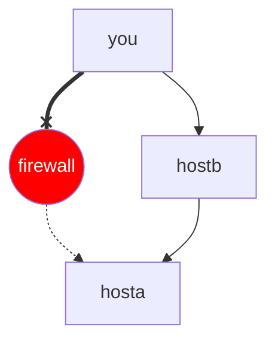
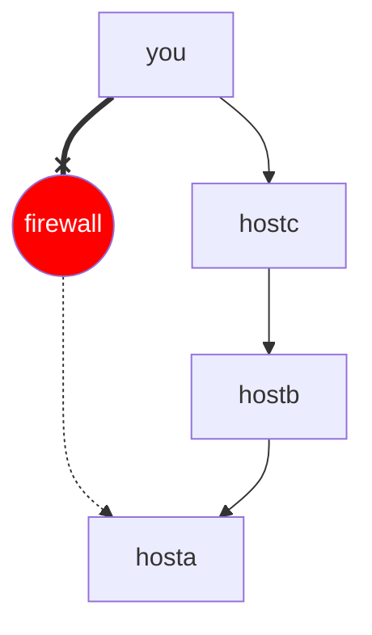

# assh

[](https://pkg.go.dev/moul.io/assh/v2)
[](https://opencollective.com/assh) 
[](https://circleci.com/gh/moul/assh)
[](https://github.com/moul/assh/releases)
[](https://goreportcard.com/report/moul.io/assh)


## Overview

A *transparent wrapper* that adds support for **regex**, **aliases**, **gateways**, **dynamic hostnames**, **graphviz**, **json output**, **yaml configuration**, and more to **SSH**.

[lib-ssh](https://www.libssh.org) wraps `assh` as a [ProxyCommand](https://en.wikibooks.org/wiki/OpenSSH/Cookbook/Proxies_and_Jump_Hosts#ProxyCommand_with_Netcat); it means that it works seamlessly with:

  * [ssh](http://www.openbsd.org/cgi-bin/man.cgi?query=ssh&sektion=1)
  * [scp](http://www.openbsd.org/cgi-bin/man.cgi?query=scp&sektion=1)
  * [rsync](http://linuxcommand.org/man_pages/rsync1.html)
  * [git](https://www.kernel.org/pub/software/scm/git/docs/)
  * Desktop applications depending on `lib-ssh` or `ssh` (i.e., [Tower](http://www.git-tower.com), [Atom.io](https://atom.io), [SSH Tunnel Manager](http://projects.tynsoe.org/fr/stm/))

For specific examples, see [3rd Party Integration](#3rd-party-integration)

## Features

### Configuration features

  * **regex** support
  * **aliases** `gate` -> `gate.domain.tld`
  * **gateways** -> transparent ssh connection chaining
  * **includes**: split configuration in multiple files, note that OpenSSH as of v7.3 has [native support for this](https://www.openssh.com/txt/release-7.3)
  * **local command execution**: finally the reverse of **RemoteCommand**
  * **templates**: equivalent to host but you can't connect directly to a template, perfect for inheritance
  * **inheritance**: make hosts inherits from host hosts or templates
  * **variable expansion**: resolve variables from the environment
  * **smart proxycommand**: RAW tcp connection when possible with `netcat` and `socat` as default fallbacks
  * **rate limit**: configure a per-host or global rate-limiting
  * **JSON output**
  * **[Graphviz](http://www.graphviz.org/)**: graphviz reprensentation of the hosts

### Using Gateway from command line

*assh* can use the [ProxyCommand with netcat](https://en.wikibooks.org/wiki/OpenSSH/Cookbook/Proxies_and_Jump_Hosts#ProxyCommand_with_Netcat) feature of OpenSSH **transparently** and without the pain of using extended configuration.

Connect to `hosta` using `hostb` as a gateway.



```console
$ ssh hosta/hostb
user@hosta $
```

Equivalent to `ssh -o ProxyCommand="ssh hostb nc %h %p" hosta`

---

Connect to `hosta` using `hostb` as a gateway using `hostc` as a gateway.



```console
$ ssh hosta/hostb/hostc
user@hosta $
```

Equivalent to `ssh -o ProxyCommand="ssh -o ProxyCommand='ssh hostc nc %h %p' hostb nc %h %p" hosta`

### Using Gateways from configuration file

You can define an equivalent of the ["ProxyCommand with netcat"](https://en.wikibooks.org/wiki/OpenSSH/Cookbook/Proxies_and_Jump_Hosts#ProxyCommand_with_Netcat) feature of OpenSSH, with a simpler syntax, more advanced workflows, and a unique fallback feature.

Let's consider the following `assh.yml` file
```yaml
hosts:
  hosta:
    Hostname: 1.2.3.4

  hostb:
    Hostname: 5.6.7.8
    Gateways: hosta

  hostc:
    Hostname: 9.10.11.12
    Gateways: hostb

  hostd:
    Hostname: 13.14.15.16
    GatewayConnectTimeout: 2
    Gateways:
    - direct
    - hosta
```

  * `ssh hosta` -> `ssh 1.2.3.4`
  * `ssh hostb` -> `ssh -o ProxyCommand="ssh hostb nc %h %p" hosta`
  * `ssh hostc` -> `ssh -o ProxyCommand="ssh -o ProxyCommand='ssh hostc nc %h %p' hostb nc %h %p" hosta`
  * `ssh hostd` ->
    * assh will try to `ssh 13.14.15.16`
    * then, fallback on `ssh -o ProxyCommand="ssh hostd nc %h %p" hosta`
    * this method allows you to have the best performances when it is possible, but ensure your commands will work if you are outside of your company for instance

### Under the hood features

  * Automatically regenerates `~/.ssh/config` file when needed
  * Inspect parent process to determine log level (if you use `ssh -vv`, **assh** will automatically run in debug mode)
  * Automatically creates `ControlPath` directories so you can use *slashes* in your `ControlPath` option, can be enabled with the `ControlMasterMkdir: true` configuration in host or globally.

### Hooks

#### Events

##### BeforeConnect

`BeforeConnect` is called just before `assh` tries to connect to the remote SSH port.

Note: `BeforeConnect` will be called for each SSH connection; if you use multiple gateways, it will be called for each gateways until one succeed to connect.

---

Example of Golang template variables:

```golang
// Host: http://godoc.org/moul.io/assh/pkg/config/#Host
{{.Host.Name}}                                  //  localhost
{{.Host.HostName}}                              //  127.0.0.1
{{.Host.Port}}                                  //  22
{{.Host.User}}                                  //  moul
{{.Host.Prototype}}                             //  moul@127.0.0.1:22
{{.Host}}                                       //  {"HostName":"localhost","Port":22","User":"moul","ControlPersist":"yes",...}
{{printf "%s:%s" .Host.HostName .Host.Port}}    //  localhost:22
```

##### OnConnect

`OnConnect` is called as soon as assh is connected to the remote SSH port.

Note: `OnConnect` is not aware of the authentication process and will always be raised.

---

Example of Golang template variables:

```golang
// Host: http://godoc.org/moul.io/assh/pkg/config/#Host
{{.Host.Name}}                                  //  localhost
{{.Host.HostName}}                              //  127.0.0.1
{{.Host.Port}}                                  //  22
{{.Host.User}}                                  //  moul
{{.Host.Prototype}}                             //  moul@127.0.0.1:22
{{.Host}}                                       //  {"HostName":"localhost","Port":22","User":"moul","ControlPersist":"yes",...}
{{printf "%s:%s" .Host.HostName .Host.Port}}    //  localhost:22

// Stats: http://godoc.org/moul.io/assh/pkg/commands/#ConnectionStats
{{.Stats.ConnectedAt}}                           //  2016-07-20 11:19:23.467900594 +0200 CEST
```

##### OnConnectError

`OnConnectError` is called when `assh` fails to open a new TCP connection.

---

Example of Golang template variables:

```golang
// Host: http://godoc.org/moul.io/assh/pkg/config/#Host
{{.Host.Name}}                                  //  localhost
{{.Host.HostName}}                              //  127.0.0.1
{{.Host.Port}}                                  //  22
{{.Host.User}}                                  //  moul
{{.Host.Prototype}}                             //  moul@127.0.0.1:22
{{.Host}}                                       //  {"HostName":"localhost","Port":22","User":"moul","ControlPersist":"yes",...}
{{printf "%s:%s" .Host.HostName .Host.Port}}    //  localhost:22

// Error
{{.Error}}                                      //  dial tcp: lookup localhost: no such host
```

##### OnDisconnect

`OnDisconnect` is called as the assh socket is closed.

**warning**: if you don't see a notification when closing an SSH connection, then you probably have `ControlMaster` configured; `OnDisconnect` is not linked to the `ssh` program but to its **socket** which may stay alive even after exiting the `ssh` program.

---

Example of Golang template variables:

```golang
// Host: http://godoc.org/moul.io/assh/pkg/config/#Host
{{.Host.Name}}                                  //  localhost
{{.Host.HostName}}                              //  127.0.0.1
{{.Host.Port}}                                  //  22
{{.Host.User}}                                  //  moul
{{.Host.Prototype}}                             //  moul@127.0.0.1:22
{{.Host}}                                       //  {"HostName":"localhost","Port":22","User":"moul","ControlPersist":"yes",...}
{{printf "%s:%s" .Host.HostName .Host.Port}}    //  localhost:22

// Stats: http://godoc.org/moul.io/assh/pkg/commands/#ConnectionStats
{{.Stats.ConnectedAt}}                           //  2016-07-20 11:19:23.467900594 +0200 CEST
{{.Stats.WrittenBytes}}                          //  3613
{{.Stats.WrittenBytesHuman}}                     //  3.6kb
{{.Stats.DisconnectAt}}                          //  2016-07-20 11:19:29,520515792 +0200 CEST
{{.Stats.ConnectionDuration}}                    //  6.052615198s
{{.Stats.ConnectionDurationHuman}}               //  6s
{{.Stats.AverageSpeed}}                          //  596.933bps
{{.Stats.AverageSpeedHuman}}                     //  3.4kb/s
```

##### BeforeConfigWrite

`BeforeConfigWrite` is called just before `assh` rewrite the `~/.ssh/config` file.

---

Example of Golang template variables:

```golang
{{.SSHConfigPath}}                               // ~/.ssh/config
```

#### Hooks drivers

##### Exec driver

Exec driver uses [Golang's template system](https://golang.org/pkg/text/template/) to execute a shell command

Usage: `exec <binary> [args...]`

```yaml
defaults:
  Hooks:
    OnConnect: exec echo '{{.Host}}' | jq .
# executes: `echo '{"HostName":"localhost","Port":"22","User":"moul","ControlPersist":"yes",...}' | jq .
# which results in printing a pretty JSON of the host
# {
#   "HostName": "localhost",
#   "Port": "22",
#   "User": "moul",
#   "ControlPersist": "yes",
#   ...
# }
```

```yaml
defaults:
  Hooks:
    OnConnect: exec echo 'New SSH connection to {{.Host.Prototype}}.' | mail -s "SSH connection journal" m+assh@42.am
# send an email with the connection prototype
```

```yaml
defaults:
  Hooks:
    BeforeConfigWrite: exec cp {{.SSHConfigPath}} {{.SSHConfigPath}}.backup
# make a copy of ~/.ssh/config before being rewritten
```

```yaml
defaults:
  Hooks:
    AfterConfigWrite: 'exec echo "# date: `date`" >> {{.SSHConfigPath}}'
# Append a comment with the compilation date to the generated ~/.ssh/config file
```

```yaml
defaults:
  Hooks:
  AfterConfigWrite: 'exec cat /path/to/my/provider/generated/.ssh/config >> {{.SSHConfigPath}}'
# Append another .ssh/config file to the generated .ssh/config file
```

---

The `exec` commands are blocking, a new driver for background tasks is planned. For now, you can run a job in background like this:

```yaml
defaults:
  Hooks:
    OnConnect:
    - exec sleep 60 &
# execute the `sleep 60` command in background (non-blocking)
# if you quit your ssh connection, the process will continue in background.
```

##### Write driver

Write driver uses [Golang's template system](https://golang.org/pkg/text/template/) to write out data to stdout

Usage: `write <line:string...>`

```yaml
defaults:
  Hooks:
    OnConnect:
    - write New SSH connection to {{.Host.Prototype}}.
# writes: "New SSH connection to moul@127.0.0.1:22." on the terminal on connection
```

```yaml
defaults:
  Hooks:
    OnDisconnect:
    - "write SSH connection to {{.Host.Name}} closed, {{ .Stats.WrittenBytes }} bytes written in {{ .Stats.ConnectionDuration }} ({{ .Stats.AverageSpeed }})"
# writes: SSH connection to localhost closed, 40 bytes written.
```

##### Notify driver

Notify driver uses [Golang's template system](https://golang.org/pkg/text/template/) to open Desktop notifications.

  * **Mac OS X**: Built-in support
  * **Linux**: Depends on [gnotifier](https://github.com/haklop/gnotifier)
  * **Windows**: Not supported
  * **BSD**: Not supported

Usage: `notify <line:string...>`

```yaml
defaults:
  Hooks:
    OnConnect: notify New SSH connection to {{.Host.Prototype}}.
```


```yaml
defaults:
  Hooks:
    OnDisconnect:
    - "notify SSH connection to {{.Host.Name}} closed, {{ .Stats.WrittenBytes }} bytes written in {{ .Stats.ConnectionDuration }} ({{ .Stats.AverageSpeed }})"
```


## Configuration

`assh` now manages the `~/.ssh/config` file, take care to keep a backup your `~/.ssh/config` file.

`~/.ssh/assh.yml` is a [YAML](http://www.yaml.org/spec/1.2/spec.html) file containing:

  * a `hosts` dictionary containing multiple *HOST* definitions
  * a `defaults` section containing global flags
  * and an `includes` section containing path to other configuration files

```yaml
hosts:

  homer:
    # ssh homer ->  ssh 1.2.3.4 -p 2222 -u robert
    Hostname: 1.2.3.4
    User: robert
    Port: 2222

  bart:
    # ssh bart ->   ssh 5.6.7.8 -u bart           <- direct access
    #            or ssh 5.6.7.8/homer -u bart     <- using homer as a gateway
    Hostname: 5.6.7.8
    User: bart
    Gateways:
    - direct                   # tries a direct access first
    - homer                    # fallback on homer gateway

  maggie:
    # ssh maggie ->   ssh 5.6.7.8 -u maggie       <- direct access
    #              or ssh 5.6.7.8/homer -u maggie   <- using homer as a gateway
    User: maggie
    Inherits: bart             # inherits rules from "bart"

  bart-access:
    # ssh bart-access ->  ssh home.simpson.springfield.us -u bart
    Inherits:
    - bart-template
    - simpson-template

  lisa-access:
    # ssh lisa-access ->  ssh home.simpson.springfield.us -u lisa
    Inherits:
    - lisa-template
    - simpson-template

  marvin:
    # ssh marvin    -> ssh marvin    -p 23
    # ssh sad-robot -> ssh sad-robot -p 23
    # ssh bighead   -> ssh bighead   -p 23
    # aliases inherit everything from marvin, except hostname
    Port: 23
    Aliases:
    - sad-robot
    - bighead

  dolphin:
    # ssh dolphin   -> ssh dolphin -p 24
    # ssh ecco      -> ssh dolphin -p 24
    # same as above, but with fixed hostname
    Port: 24
    Hostname: dolphin
    Aliases: ecco
    RateLimit: 10M # 10Mbytes/second rate limiting

  schooltemplate:
    User: student
    IdentityFile: ~/.ssh/school-rsa
    ForwardX11: yes

  schoolgw:
    # ssh school ->   ssh gw.school.com -l student -o ForwardX11=no -i ~/.ssh/school-rsa
    Hostname: gw.school.com
    ForwardX11: no
    Inherits: schooltemplate

  "expanded-host[0-7]*":
    # ssh somehost2042 ->       ssh somehost2042.some.zone
    Hostname: "%h.some.zone"

  vm-*.school.com:
    # ssh vm-42.school.com ->   ssh vm-42.school.com/gw.school.com -l student -o ForwardX11=yes -i ~/.ssh/school-rsa
    Gateways: schoolgw
    Inherits: schooltemplate
    # do not automatically create `ControlPath` -> may result in error
    ControlMasterMkdir: true

  "*.shortcut1":
    ResolveCommand: /bin/sh -c "echo %h | sed s/.shortcut1/.my-long-domain-name.com/"

  "*.shortcut2":
    ResolveCommand: /bin/sh -c "echo $(echo %h | sed s/.shortcut2//).my-other-long-domain-name.com"

  "*.scw":
    # ssh toto.scw -> 1. dynamically resolves the IP address
    #                 2. ssh {resolved ip address} -u root -p 22 -o UserKnownHostsFile=null -o StrictHostKeyChecking=no
    # requires github.com/scaleway/scaleway-cli
    ResolveCommand: /bin/sh -c "scw inspect -f {{.PublicAddress.IP}} server:$(echo %h | sed s/.scw//)"
    User: root
    Port: 22
    UserKnownHostsFile: /dev/null
    StrictHostKeyChecking: no

  my-env-host:
    User: user-$USER
    Hostname: ${HOSTNAME}${HOSTNAME_SUFFIX}

templates:
  # Templates are similar to Hosts; you can inherit from them
  # but you cannot ssh to a template
  bart-template:
    User: bart
  lisa-template:
    User: lisa
  simpson-template:
    Host: home.simpson.springfield.us

defaults:
  # Defaults are applied to each hosts
  ControlMaster: auto
  ControlPath: ~/tmp/.ssh/cm/%h-%p-%r.sock
  ControlPersist: yes
  Port: 22
  User: bob
  Hooks:
    # Automatically backup ~/.ssh/config
    BeforeConfigWrite:
      - 'exec set -x; cp {{.SSHConfigPath}} {{.SSHConfigPath}}.bkp'

    AfterConfigWrite:
      # Concat another `ssh_config` file with the one just generated by `assh`
      - 'exec cat ~/.ssh/my-heroku-generated-config >> {{.SSHConfigPath}}'

      # Alert me with a Desktop notification
      - notify "{{.SSHConfigPath}} has been rewritten"

    OnConnect:
      # Log internal information to a file
      - exec printf '{{.}}' | jq . >> ~/.ssh/last_connected_host.txt

      # Alert me with a Desktop notification
      - notify New SSH connection to {{.Host.Prototype}} at {{.Stats.ConnectedAt}}

      # Write the host prototype to the terminal stderr
      - write New SSH connection to {{.Host.Prototype}}

    OnDisconnect:
      # write on terminal and in a Desktop notification some statistics about the finished connection
      - "write  SSH connection to {{.Host.HostName}} closed, {{.Stats.WrittenBytes }} bytes written in {{.Stats.ConnectionDuration}} ({{.Stats.AverageSpeed}}bps)"
      - "notify SSH connection to {{.Host.HostName}} closed, {{.Stats.WrittenBytes }} bytes written in {{.Stats.ConnectionDuration}} ({{.Stats.AverageSpeed}}bps)"

includes:
- ~/.ssh/assh.d/*.yml
- /etc/assh.yml
- $ENV_VAR/blah-blah-*/*.yml

ASSHBinaryPath: ~/bin/assh  # optionally set the path of assh
```

For further inspiration, these [`assh.yml` files on public GitHub projects](https://github.com/search?utf8=%E2%9C%93&q=in%3Apath+assh.yml+extension%3Ayml&type=Code) can educate you on how people are using assh

## Usage

`assh` usage

```
NAME:
   assh - advanced ssh config

USAGE:
   assh [global options] command [command options] [arguments...]

VERSION:
2.8.0 (HEAD)

AUTHOR(S):
   Manfred Touron <https://github.com/moul/assh>

COMMANDS:
   ping          Send packets to the SSH server and display statistics
   info          Display system-wide information
   config        Manage ssh and assh configuration
   sockets       Manage control sockets
   help, h       Shows a list of commands or help for one command

GLOBAL OPTIONS:
  --config value, -c value       Location of config file (default: "~/.ssh/assh.yml") [$ASSH_CONFIG]
  --debug, -D                    Enable debug mode [$ASSH_DEBUG]
  --verbose, -V                  Enable verbose mode
  --help, -h                     show help
  --version, -v                  print the version
```

### Usage examples

#### `assh config build`

Rewrites and replaces the existing ~/.ssh/config file.

This action is automatically done by assh when detecting configuration changes.
Running this command is useful to set up assh or repair the configuration file.

```console
$ assh config build > ~/.ssh/config
```

#### `assh config list`

List hosts and options.

```console
$ assh config list
Listing entries

    *.scw -> root@[hostname_not_specified]:22
        StrictHostKeyChecking=no [custom options]
        UserKnownHostsFile=/dev/null [custom options]

    *.shortcut1 -> bob@[hostname_not_specified]:22

    *.shortcut2 -> bob@[hostname_not_specified]:22

    bart -> bart@5.6.7.8:22

    bart-access -> bob@[hostname_not_specified]:22

    dolphin -> bob@dolphin:24

    expanded-host[0-7]* -> bob@%h.some.zone:22

    homer -> robert@1.2.3.4:2222

    lisa-access -> bob@[hostname_not_specified]:22

    maggie -> maggie@[hostname_not_specified]:22

    marvin -> bob@[hostname_not_specified]:23

    my-env-host -> user-moul@[hostname_not_specified]:22

    schoolgw -> bob@gw.school.com:22
        ForwardX11=no [custom options]

    schooltemplate -> student@[hostname_not_specified]:22
        ForwardX11=yes [custom options]
        IdentityFile=~/.ssh/school-rsa [custom options]

    vm-*.school.com -> bob@[hostname_not_specified]:22

    (*) General options:
        ControlMaster: auto
        ControlPath: ~/tmp/.ssh/cm/%h-%p-%r.sock
        ControlPersist: yes
        Port: 22
        User: bob
```

#### `assh config graphviz`

Generate a [graphviz](http://www.graphviz.org/) graph of the hosts

```console
$ assh config graphviz | dot -Tpng > assh-hosts.png
```


#### `assh config search <keyword>`

Search for `<keyword>` in hosts and host options.

```console
$ assh config search bart
Listing results for bart:
    bart -> bart@5.6.7.8:22
    bart-access -> moul@[hostname_not_specified]:22
```

#### `assh info`

Display system-wide information.

```console
$ assh info
Debug mode (client): false
CLI Path: /path/to/assh
Go version: go1.6.2
OS/Arch: darwin/amd64

RC files:
- ~/.ssh/assh.yml
- ~/.ssh/assh.d/hosts.yml
- ~/.ssh/assh.d/moul.yml
- ~/.ssh/assh.d/test.yml

Statistics:
- 299 hosts
- 2 templates
- 4 included files
```

#### `assh sockets list`

List active control sockets.

```console
$ assh sockets list
4 active control sockets in "~/.ssh/cm/":

- bart/homer/lisa-22-root.sock (14 minutes)
- bart/homer-22-root.sock (14 minutes)
- bart-22-root.sock (14 minutes)
- marge-22-bart.sock (1 hour)
```

#### `assh sockets flush`

Close active control sockets.

```console
$ assh sockets flush
Closed 4 control sockets.
```

#### `assh sockets master`

Create a master control sockets.

```console
$ assh sockets master
```

#### `assh ping`

Send packets to the SSH server and display stats.

```console
$ assh ping -c 4 localhost
PING localhost (127.0.0.1) PORT 22 (ssh) PROTO tcp
Connected to 127.0.0.1: seq=0 time=321µs protocol=tcp port=22
Connected to 127.0.0.1: seq=1 time=501µs protocol=tcp port=22
Connected to 127.0.0.1: seq=2 time=550µs protocol=tcp port=22
Connected to 127.0.0.1: seq=3 time=641µs protocol=tcp port=22

--- localhost assh ping statistics ---
4 packets transmitted, 4 packets received, 0.00% packet loss
round-trip min/avg/max = 321µs/503.25µs/641µs
```

## Install

Get the latest version using GO (recommended way):

```bash
go get -u moul.io/assh/v2
```

**note**: tested with Go1.7 or above

---

Get the latest released version using homebrew (Mac OS X):

```bash
brew install assh
```

Build the latest version

```bash
brew install assh --HEAD
```

---

Get a released version on: https://github.com/moul/assh/releases

---

Install with [asdf-vm](https://asdf-vm.com/):
```bash
asdf plugin add assh
asdf install assh latest
asdf global assh latest
```

---

### Register the wrapper (optional)

To improve experience when using advanced pattern matching, add the following at the end of your `.bashrc` / `.zshrc` / `config.fish`:

```bash
alias ssh="assh wrapper ssh --"
```

This step is not *mandatory* but highly *recommended*.

---

**Note**: `ssh` does not understand advanced patterns;
To bypass this limitation, `assh` maintains a list of *known hosts* and regenerate the `~/.ssh/config` with all those expanded *known hosts*.

Without the wrapper, the `~/.ssh/config` risks to be outdated when connecting to a new host for the first time and you will need to launch the command again.

With the wrapper, `ssh` will *always* be called with an updated `~/.ssh/config` file.

## Getting started

  1. Backup your old `~/.ssh/config`: `cp ~/.ssh/config ~/.ssh/config.backup`
  2. Create a new `~/.ssh/assh.yml` file
  3. Run `assh config build > ~/.ssh/config` to validate the syntax of your `~/.ssh/assh.yml` file and automatically build your `~/.ssh/config` file
  4. You are ready!

## Webapp

`assh` contains an experimental web application hosted on heroku: https://assh.herokuapp.com/

---

Convert an `assh.yml` file to `ssh_config` format:

```console
$ http --form POST https://assh-dev.herokuapp.com/assh-to-ssh assh_config=@~/.ssh/assh.d/test.yml | jq -r .ssh_config
# This file was automatically generated by assh v2.8.0
# on 2018-07-03 21:06:56 +0000 UTC, based on ~/.ssh/assh.yml
#
# more info: https://github.com/moul/assh

# host-based configuration
Host *.scw
  Port 22
  StrictHostKeyChecking no
  User root
  UserKnownHostsFile /dev/null
  # ResolveCommand: /bin/sh -c "scw inspect -f {{.PublicAddress.IP}} server:$(echo %h | sed s/.scw//)"

Host lalala
  Port 22
  User moul
  # HostName: 127.0.0.1

Host toto[0-5]toto
  User samantha

# global configuration
Host *
  ProxyCommand assh connect --port=%p %h
```

---

* [Apiary Documentation](http://docs.assh.apiary.io/)


## Docker

Experimental: `assh` may run in Docker, however you will have limitations:

  * The `assh` containers does not have any binaries except `assh`, you can't use `ProxyCommand`, `ResolveCommand`...
  * Docker may run on another host, `ssh localhost` will ssh to Docker host

```console
docker run -it --rm -v ~/.ssh:/.ssh moul/assh --help
```

`assh` in Docker is slower and has more limitations, but it may be useful for testing or if you plan to use a Docker host as a remote Gateway

## Alternative version

  * [v1](https://github.com/moul/assh/tree/v1) (2009-2015) - The original implementation. It worked quite well, but was a lot slower, less portable, harder to install for the user and harder to work on to develop new features and fix bugs

## Troubleshooting

### I can't use gateways

`assh` uses the [built-in netcat mode of OpenSSH (shipped with OpenSSH 5.4)](https://en.wikibooks.org/wiki/OpenSSH/Cookbook/Proxies_and_Jump_Hosts#Passing_through_a_gateway_using_netcat_mode) by default.
If your ssh client doesn't support this feature, you can configure a custom `ProxyCommand` configuration, i.e.,

```yaml
hosts:
  myserver:
    host: 1.2.3.4
    gateways: mygateway
    # configure a custom proxycommand
    proxycommand: /bin/nc %h %p

  mygateway:
    host: 5.6.7.8
```

---

You can configure this rule globally:

```yaml
defaults:
  proxycommand: nc %h %p
```

---

Also, be sure to have netcat installed on your system, or use an alternative proxy binary, i.e., `socat`.

### How to Configure resolver to parse `/etc/hosts` and/or handle **mDNS** requests

**assh** resolves hostnames using the system built-in resolver, depending on the OS, you can enable new features and/or change modules order.

  * [Linux - nsswitch documentation](http://man7.org/linux/man-pages/man5/nsswitch.conf.5.html)
  * [Linux - mDNS support (nss-mdns)](http://0pointer.de/lennart/projects/nss-mdns/)
  * [Mac OS X - `/etc/resolv.conf` documentation](https://developer.apple.com/library/mac/documentation/Darwin/Reference/ManPages/man5/resolver.5.html)

### `unix_listener: "/Users/.../.ssh/cm/..." too long for Unix domain socket`

Starting with `OpenSSH v6.7` the socket name can be shortened by configuring `%C` for the name expansion.

```yaml
defaults:
  ControlPath: ~/tmp/.ssh/cm/%C.sock
```

`%C` is a unique identifier based on a hash of the tuple of (local host, remote user, hostname, port).

### How to disable the automatic configuration rewrite

Each time you call `ssh`, `assh` will check if the generated `~/.ssh/config` file is outdated.

By default, it will transparently regenerate the configuration file if needed.

You can disable this behavior by generating the configuration file like this:

```bash
assh config build --no-automatic-rewrite
```

## 3rd Party Integration

### Ansible

In your ansible.cfg under ssh_connection, make sure you have the following, changing the path to your assh:
```
[ssh_connection]
ansible_ssh_executable = '/usr/local/bin/assh wrapper ssh'
```

### 3rd Party Projects

  * [ansible-dotfiles-assh](https://github.com/wrboyce/ansible-dotfiles-assh): Ansible - Configure SSH with   ASSH
  * [appflow](https://github.com/ttssdev/appflow): Multitenant environment automation

## Contributors

### Code Contributors

This project exists thanks to all the people who contribute. [[Contribute](CONTRIBUTING.md)].
<a href="https://github.com/moul/assh/graphs/contributors"></a>

### Financial Contributors

Become a financial contributor and help us sustain our community. [[Contribute](https://opencollective.com/assh/contribute)]

#### Individuals

<a href="https://opencollective.com/assh"></a>

#### Organizations

Support this project with your organization. Your logo will show up here with a link to your website. [[Contribute](https://opencollective.com/assh/contribute)]

<a href="https://opencollective.com/assh/organization/0/website"></a>
<a href="https://opencollective.com/assh/organization/1/website"></a>
<a href="https://opencollective.com/assh/organization/2/website"></a>
<a href="https://opencollective.com/assh/organization/3/website"></a>
<a href="https://opencollective.com/assh/organization/4/website"></a>
<a href="https://opencollective.com/assh/organization/5/website"></a>
<a href="https://opencollective.com/assh/organization/6/website"></a>
<a href="https://opencollective.com/assh/organization/7/website"></a>
<a href="https://opencollective.com/assh/organization/8/website"></a>
<a href="https://opencollective.com/assh/organization/9/website"></a>


### Stargazers over time

[](https://starchart.cc/moul/assh)
      

## License

© 2009-2021 Manfred Touron - MIT License
